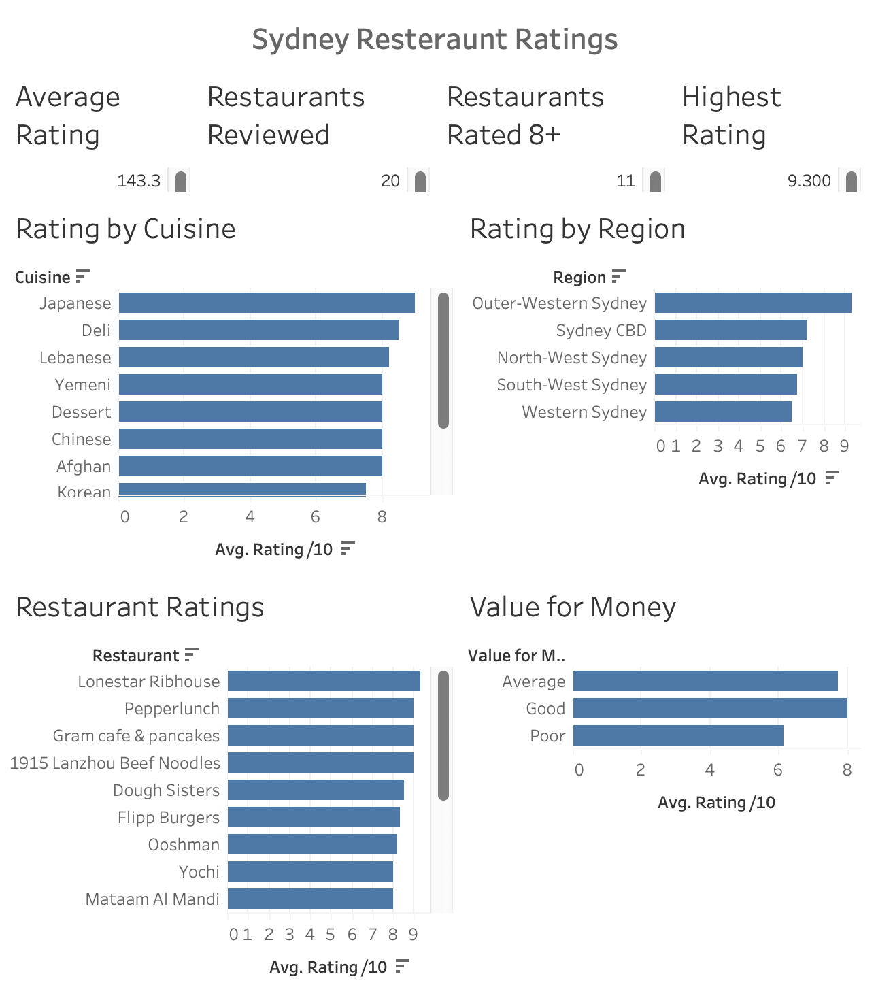

# 🍽️ Restaurant Data Analysis & Tableau Dashboard

## Overview

This project analyses my personal restaurant visits and ratings to explore patterns and trends across different restaurants.

I collected data from restaurants I visited and recorded information such as restaurant name, cuisine, location and rating. I then organised and analysed the data using Microsoft Excel before creating an interactive dashboard in Tableau Public.

The goal of this project was to turn my restaurant experiences into a structured dataset and use data analysis and visualisation to identify interesting trends across the restaurants I visited.

## 🛠️ Tools Used

* Microsoft Excel
* Tableau Public
* GitHub

## 📊 Project Process

### 1. Data Collection

I collected and recorded data from restaurants I personally visited, creating a dataset that could be used for analysis.

### 2. Data Cleaning & Analysis

I used Excel to organise, clean and analyse the restaurant data.

This included:

* Sorting and filtering data
* Cleaning and organising values
* Using lookup functions
* Calculating average ratings
* Counting restaurants by different categories
* Comparing restaurant ratings and characteristics

### 3. Data Visualisation

The cleaned dataset was used in Tableau Public to create an interactive dashboard.

The dashboard presents the restaurant data through visualisations, allowing different restaurants, cuisines and ratings to be compared.

## 📈 Tableau Dashboard

🔗 [View the interactive Tableau dashboard](https://public.tableau.com/views/Book1_17903028380020/Dashboard1?:language=en-US&publish=yes&:display_count=n&:origin=viz_share_link)

## 🔍 Key Insights

The project explores:

* How restaurant ratings differ across cuisines
* Average ratings across different categories
* The number of restaurants within each cuisine category
* How individual restaurant ratings compare
* Patterns across the restaurants I visited

## 📁 Project Files

| File/Folder                         | Description                                   |
| ----------------------------------- | --------------------------------------------- |
| `data/restaurant_data.xlsx`         | Excel dataset containing the restaurant data  |
| `tableau/restaurant_dashboard.twbx` | Tableau workbook used to create the dashboard |
| `images/restaurant_dashboard.png`   | Screenshot of the completed Tableau dashboard |

## 💡 Skills Demonstrated

* Data collection
* Data cleaning
* Data analysis
* Microsoft Excel
* Tableau Public
* Data visualisation
* Dashboard development
* Data storytelling
* GitHub
